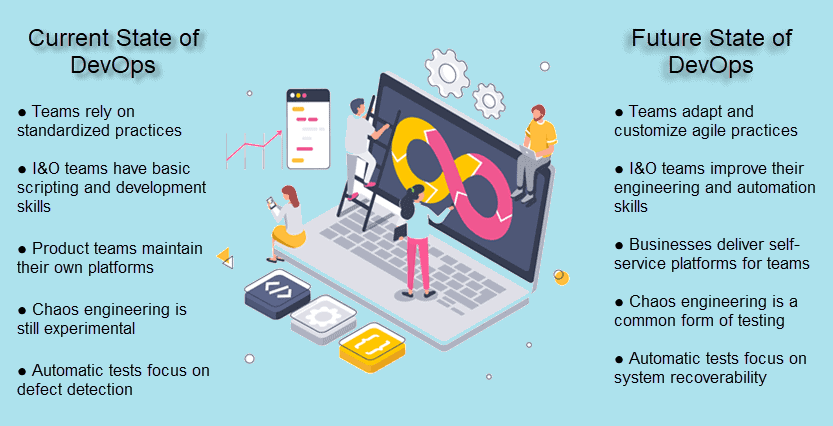

2020 年即将即将结束，也到了预测一下 DevOps 在来年的一些发展于变化。本文先看看别人的预测，最后我自己也凭借自己在 DevOps 领域这几年的经验和认知，也大胆预测一下。

---
# 
别人的预测

******

> 本文翻译自 Andreja Velimirovic 的 Top 8 DevOps Trends for 2021 一文。原文可看[这儿](https://phoenixnap.com/blog/devops-trends)。

DevOps 是软件有效交付的一个领先模型，而且此领域没有停滞的迹象。DevOps 社区一直在搜寻优化开发效率、提高生产力的方式，因此思想和流程的转变是以 DevOps 为中心的软件开发模式中的核心部分。

此文章会就 **2021 年 DevOps 的八大趋势**做一个解释。

继续阅读，了解来年 DevOps 的期望，并了解你的团队需要做什么来保持竞争力。

# DevOps 值得关注的趋势

## 1. 基础设施自动化（IA）工具的成熟

基础设施自动化工具能够使团队在 on-premise 和云环境中设计和自动化交付服务。在 2021 年，DevOps 团队将使用 IA 以更高的可靠性在大规模实施自动化 IT 基础设施的交付、配置和管理。

IA 工具能够给 DevOps 团队提供众多的收益：

* 多云和混合云基础设施的编排。
* 不可变和可编程基础设施的支持。
* 自服务、按需所需环境的创建。
* 高效的资源配置。
* 实验的简单性。

我们将在未来看到 IA 工具和其他流水线组件的更多集成。通过将 CI/CD 概念应用于 IT 基础设施，团队将能享受到更多的灵活性。

> 查看[持续集成、持续部署和持续交付之间的区别](https://phoenixnap.com/blog/continuous-delivery-vs-deployment-vs-integration)，三种实践使 DevOps 团队快速、精确的工作。

**2021 年的期望：** 企业将开始用企业级的 IA 工具取代自定义的设置。通过利用 IA 工具来自动化软件的部署和配置，企业将获得：

* 更快的开发。
* 可重复、一致的基础设施。
* 由于手动任务减少使成本降低。
* 由于跨所有物理和虚拟基础设施的可靠性设置，更容易实现合规。

预计**连续配置自动化（CCA）** 的工具也会增加。这些工具提供了以代码形式管理和交付配置更改的能力。CCA 工具的范围将会继续扩展至网络、容器、合规及安全范畴。

> 查看[裸金属云](https://phoenixnap.com/bare-metal-cloud)服务器是如何帮助实施基础设施自动化管理流程的。

## 2. 应用程序发布编排（ARO）工具的使用

ARO 工具将流水线、环境管理和版本编排结合起来。这些工具能够带来以下好处：

* **更多的灵活性：** 团队能更快、更可靠的交付新应用、应对变更和修复缺陷。
* **更高的生产力：** 更少的手动任务能允许成员更关注于高价值任务。
* **更好的可视性：** 在资源调配过程中，瓶颈和等待状态变得可见。

ARO 工具将进一步提高产品发布的质量和速度。公司将利用多种方式、[DevOps 流水线](https://phoenixnap.com/blog/devops-pipeline)、流程及工具，在多团队之间进行版本发布活动。

**2021 年期望什么：** ARO 工具将变得更加普遍。新变更的快速交付将允许来对市场需求的快速改变做对应对。

## 3. 更复杂的工具链

DevOps 工具链是一系列支持流水线活动的工具集。设计良好的工具能够让团队：

* 为了共同目的而一起工作。
* 得到精确的测量指标。
* 获取所有代码变更的快速反馈。

DevOps 工具链正在变得越来越复杂和宽泛。CI 工具随着新系统的发展而演进，这些系统能够让创建和维护构建脚本变得简单。流水线正在获得一些新的安全特性。支持包管理和容器管理的工具也正在迅速发展。

组织须通过避免重叠、冲突和功能差距来确保工具链的正确使用。

**2021 年的期望：** 工具链供应商将开始在整个开发和交付周期内提供更广泛的解决方案。企业将有用不止一条工具链来支持不同技术栈和交付平台（COTS、云、主机、容器原生等等）。

## 4. DevSecOps 的升温

**云原生安全会变得越来越重要，因为企业或者组织都在积极拥抱[Kubernetes](https://phoenixnap.com/kb/understanding-kubernetes-architecture-diagrams)，serverless 和其他基于云计算的技术。** 团队需要新的工具和流程来保护资产。这就是为什么我们预测在来年**DevSecOps**的采用会是非常广泛的。

**DevSecOps 是将[安全和合规](https://phoenixnap.com/blog/security-vs-compliance)测试集成到开发的流水线中。** DevSecOPs 应该是：

* 无缝衔接到软件开发生命周期中。
* 给相关利益干系人提供透明的结果。
* 不会降低开发人员的灵活性。
* 不需要团队离开他们的开发环境。
* 提供运行时的安全保护。

DevSecOps 正在变成可编程的，因此在接下来的几年期望能够看到更高层次的一些自动化。

> 请看[DevOps 安全最佳实践](https://phoenixnap.com/blog/devops-security-best-practices)来确保你的团队正在以安全可靠的方式运营者。

**2021 年期望什么：** DevOps 流水线中安全将不再是被滞后考虑的事情。DevSecOps 将以更高的速度和标准的 CI/CD 测试工具进行集成。结果就是，公司将看到[网络安全](https://phoenixnap.com/blog/cybersecurity-best-practices)、合规、规则和协议执行以及总体 IT 效率方面的改善。

## 5. 应用程序性能监控（APM）软件

在软件开发中，APM 在给开发人员提供快速反馈的过程中扮演了着重要的角色。APM 关键包括：

* 前端监控（观察用户交互的性能和行为）。
* 应用发现、跟踪及诊断（ADTD 分析了 web 和应用程序服务器、微服务及基础设施之间的关系）。
* AIOps 使能分析（探测生命周期内的模式、异常及因果关系）。

在 2021 年，APM 将极大的缩短 MTTR（平均修复时间 Mean Time to Repair）、提高服务可用性和改善用户体验。高级的 APM 能力将帮助 DevOps 团队：

* 更好的理解业务流程。
* 深入了解业务运维。
* 对问题进行优先排序和隔离。

**2021 年期望什么：** APM 提供商将进一步扩展他们的服务提供能力，包括基础设施监控和分析的集成（包括网络、服务器、数据库、日志、容器、微服务以及云计算服务）。厂商也将继续在 APM 中使用机器学习（ML machine learning）：

* 降低系统噪音。
* 异常预测和检测。
* 发现前因后果。

对客户体验的日益重视将推动 APM 软件能够对客户旅程有深入的洞察力。组织将开始依赖更多的 APM 来保护及更好的理解他们的应用。

## 6. 广泛的云管理平台（CMP）

云管理平台（CMP）帮助团队来管理公有云、私有云及多云服务和资源。CMP 能力可能是单个产品或一系列厂商提供服务的一种结果展示。

在 2021 年，组织将开始使用 CMP 来降低运维成本，同时确保适当的服务等级。CMP 将给业务提供诸多能力：

* 管理和编排。
* 服务请求管理。
* 目录和分类。
* [云监控和分析](https://phoenixnap.com/blog/cloud-monitoring-tools)。
* 资源优化。
* 云迁移、备份和灾备。
* 增强策略和法规遵从性要求。

同时服务于开发和 I&O（基础设施和运维）人员的 CMP 能力在 2021 年将是必须的。CMP 必须是：

* 在不伤害开发灵活性的情况下介入开发流程。
* 允许 I&O 团队更容易执行资源管理标准。

**2021 年期望什么：** 企业将更好的理解 AMP 能够提供什么，不能够提供什么。企业将部署 CMP 来增加整个 DevOps 团队的灵活性。

> 阅读[五种云部署模型](https://phoenixnap.com/blog/cloud-deployment-models)来找到一款适合你的。

## 7. 更多不确定的目标和要求

双模 IT 运营使 I&O 团队能够通过分析确定的需求来支持用户。双模 IT 依赖于以下两种工作模式：

* **模式 1：** 团队已知需求且期望它们能够带来可预测的 IT 服务或产品。
* **模式 2：** 需求是不确定的且需求探索也在进行中。其结果是很难预测的。

对于模式 2 的拥抱，能够带来新的业务机遇。这些策略涉及高度的不确定性，同时存在于业务和 IT 术语范畴内。公司将优先考虑敏捷性和项目的平均时间价值，产品团队将寻求新的策略，提高用户体验。

**2021 年期望什么：** I&O 团队将不得不学习新的技能来增加敏捷性，提升业务价值。对当前流程的改变就像模式 2 中的机遇一样，需要做进一步的简化。

## 8. AgileOps 的进一步发展

AgileOps 是一套经过验证的敏捷和 DevOps 方法，可以被 I&O 用来改善敏捷性。AgileOps 技术有助于简化其他业务领域内的软件开发和相关任务：

* 为了支持开发，I&O 团队成员应该学习[DevOps 和敏捷实践](https://phoenixnap.com/blog/devops-vs-agile)。
* 对于不涉及开发的用例，团队成员应该知道 Kanban、Gemba Kaizen 及广泛的自动化等这些概念。
* 学习 scrum、精益流程及持续改进将帮助 I&O 改进产品管理技术。

**2021 年期望什么：** 日益增长的对用户需求快速响应的需求将推动 AgileOps 的增长。I&O 团队成员将使用敏捷、精益及 DevOps 概念来在不涉及应用程序开发的领域内获取更多的敏捷性。

# 2021 年（及以后）DevOps 的未来

## 基于模板的实践成为一种约束

成功的 DevOps 需要团队是自组织的，而且能够根据特定的产品需求来调整他们自身的流程。DevOps 团队将开始将标准化的方法和框架发展成定制的工作方式。

到 2023 年，75% 的公司将通过调整敏捷实践来和产品与团队的实际情况相匹配。结果就是，应用程序的交付节奏会加快。我们还将看到新兴技术的崛起，这些技术强调的是实践而非理论，例如本质和自律的敏捷。

主要影响有：

* 对特定产品（或一组相关产品）的分配将持续更长时间。
* 熟悉产品将提高团队效率。
* 对敏捷和 DevOps 来说，持续学习和适应变得更加重要。
* 团队将开始通过面向实践的技术方式来描述工作。

团队建议：

* 指定指导方针，但是允许团队选择他们其实践和工作方式。
* 在定制过程之前，确保团队了解敏捷开发是如何工作的。
* 组织研讨会与同事分享知识。
* 以面向实践的技术做实验，来记录相应的方法。

## I&O 团队将变得更敏捷

采用云原生架构和可编程的基础设施，将需要 I&O 团队变得更加敏捷。I&O 团队将不得不在基本脚本之外来扩展他们的开发技能。

可靠性工程师需要 I&O 团队能够和开发及产品团队更有效的进行协作。解决可靠性挑战需要对系统设计和运维有一个清除的认识。

到 2023 年，60% 的 I&O 团队领导将提高他们的开发技能以支持业务创新。I&O 团队将变得更擅长于：

* 系统架构。
* IT 运维人工智能（AIOps）。
* 应用程序开发。
* 测试自动化。

主要影响有：

* 软件工程师技能将使 I&O 来推动业务创新。
* I&O 将和开发团队有比以往更多的协作。
* I&O 将采用新技能的优势来提高效率及减少技术债。

团队推荐：

* 随着时间的推移，构建你的 I&O 能力。规划你的发展需求，并为如何满足这些需求制定长期计划。
* 在招聘新人才和内部员工培训之间找到平衡点。
* 注意留住员工，因为 I&O 对工程技能的需求将超过供给。

## 产品团队自助服务平台

通常，维护基础设施的产品团队缺乏时间或专业技能来优化平台使用。这些团队必须将宝贵的资源从以用户为中心的创新转移到平台维护、升级和管理上。

到 2023 年，70% 的公司将为产品团队交付共享的、自助的服务平台。这些平台将使应用程序的部署频率提高 25%。其他的收益包括：

* 更少的工具链重叠。
* 治理和安全的一致性标准。
* 更高的用户满意度。
* 更大的业务灵活性。

内部平台将更具响应性，对产品团队的约束更少。

主要的影响有：

* 企业对威胁和机遇的反应更快。
* I&O 团队成员将开始将平台视为随着业务需求变化而不断改进的产品。
* 企业将减少重叠和冗余、实现规模经济并建立高标准的治理。

团队建议：

* 建立专门的平台团队，为产品团队提供更高的灵活性。
* 组织社区分享来确保平台满足所有消费者的需求。

## 混沌工程将变成常规测试手段

到 2023 年，40% 的 DevOps 团队将使用混沌工程作为他们测试套件标准的一部分。结果就是，我们会看到非计划的宕机会减少 20%。

混沌工程依赖于故障注入来发现错误和缺陷，这些错误和缺陷通常用其他测试手段发现不了的。混沌实验对于具有多个可移动部件的复杂 IT 系统来说是一种理想手段。

> 了解更多的[混沌工程](https://phoenixnap.com/blog/chaos-engineering)，学习不可预测的测试手段是如何构建系统的韧性的。

主要影响：

* 云生产环境的混沌实验将变成持续交付流程的一个标准部分。
* 大型企业将开始使用混沌工程以更快的速度扩大规模。

团队推荐：

* 创建社区实践来构建混沌工程意识和技能。
* 培训使用开源的混沌工程工具。
* 创建可重用的实验，以帮助不同的团队扩展方法并通过熟悉的测试建立信心。

## 快速故障恢复

为了能够为用户持续的交付价值，应用程序必须一直在线且可用。在未来几年，故障恢复将是DevOps的一大改进领域。

到 2023 年，60% 的组织会将系统恢复能力的测试变成 CI/CD 流水线的一部分。

> 我们的[CI/CD 指南](https://phoenixnap.com/blog/what-is-ci-cd)解释了如何自动化发布版本，以让 DevOps 团队和组织都能获益。

主要影响：

* 恢复测试变成了自动化测试流程标准的一部分。
* QA 将更多的关注于缺陷修复。
* 团队将更加了解当前系统的可靠性和弹性。

团队建议：

* 将故障处理的整个流程自动化，就像缺陷发生在生产上一样。
* 确保系统恢复失败的所有事件都经过根本原因分析。
* 扩展QA机制，包括定期验证和系统可恢复性验证。

# 尽早采用 DevOps，保持竞争力

根据上述趋势来采用 DevOps 的公司，将会提高他们的设计、构建、部署和维护高质量产品的能力。及时拥抱这些趋势，会让公司能够在一个竞争激励的年份里，保持充足的竞争力。

---
# 
我的预测

******************

> 以下为小马哥自己的预测。

在 DevOps 领域浪荡了几年，闲来无事的时候，也会想想 DevOps 的过去、现在及未来。关于过去和现在的一些文章可以查看我的公众号**DevSecOps SIG**，今天重点聊聊未来。小马哥也斗胆预测一下。

## 再莫提 CI/CD 了

不提 CI/CD 不意味着 CI/CD 已经不重要或者不需要了。恰恰相反，CI/CD 作为 DevOps 的两大关键核心能力，对 DevOps 的推进及落地实践来说至关重要。之所以说再莫提 CI/CD，是因为 CI/CD 的发展已经像云计算的发展一样了，像水、像电，对人们来说已经触手可及了。如果还在处于认知和实践 CI/CD 的路途中，那就需要加倍努力了，毕竟这是一个**只有努力奔跑才能留在原地**的社会。

CI/CD 将更多的以研发效能平台的方式出现。

另外，抛弃**实现了 CI/CD 就等于实现了 DevOps** 的愚蠢观念吧。

## 云原生的“入侵”

云原生以摧枯拉朽之势冲击着 IT。各企业和组织对云原生也展现出积极拥抱的态势。**Kubernetes，服务网格（典型如 Istio），Serverless** 俨然成了云原生技术发展的三驾马车。Kubernetes 已经成为了容器编排的实施标准，也可以说是云原生的基座。服务网格的发展也是如火如荼，Serverless 更是众多顶级厂商极力布局的战场。

但是，目前为止，云原生也具有着无可争议的复杂性。如何在云原生的浪潮中来实施 DevOps 是每个企业或组织所面临的共同挑战。做好如下几点能够加速这一进程：

* 对云原生有一个全面的认知。
* 提升软件开发相关人员的技能。
* 选取适合团队的工具链（非最新、非最贵）。
* 有序推进云原生的落地（可参考[CNCF Trail Map](https://github.com/cncf/trailmap)）。

**不应该再纠结于要不要转向云原生，而应该更关注于如何做好云原生的落地实践。**

## DevSecOps 继续备受关注

安全是一个老生常谈的话题，在企业数字化转型、采用敏捷开发、拥抱云原生的情况下，安全的重要的就更无须多言了。安全能力将持续的集成在软件开发流程中。将安全融入 DevOps 的 DevSecOps 应该具有如下特点：

* 尽量左移，让安全在开发早期介入。
* 持续的自动化测试，做到安全的持续检测。
* 借助机器学习（ML）来做漏洞识别与安全防护。

## 人工智能（AI）的持续介入

AI 能够帮助团队来完成环境管理、漏洞识别、应用监控等重要工作。这能减少一些手动的、重复性的工作。然而，如何将复杂程度高、门槛高的 AI 融入 DevOps 中，也面临很多的挑战。

## “人”应该被重点关照

DevOps 的问题归根结底是人的问题，详情可查看这篇公众号。人是 IT 的核心要素。人才更是一个企业或组织能够长久发展的根本。一直以来，人们只关注用户侧，但是对 IT 开发相关人员却被忽略了。应该做一些下面的事情：

* **提供学习的环境：** 内外部分享和培训的机会（哪怕是需要花钱的）。
* **鼓励参加开源社区：** 开源是 IT 发展的强大推动力，参加开源社区能使每个人的眼界变宽，将开源技术带入工作中，能缩短尝试时间，同时带来创新价值。
* **重视人员的反馈：** 经常获取人员对于现有流程、使用工具、工作环境等方面的反馈，及时作出有效调整，让人员有归属感、幸福感，人员才会有激情去全身心投入工作。

带来的价值会有：

* **创新变得容易：** 眼界变宽了，知识面丰富了。利用自身能力改进现有系统，引起新系统自然而已也就水到渠成了。
* **忠诚度提高：** 员工将制定与本公司相关的个人五年计划，而不是考虑下一份工作在哪儿。
* **吸引更多的人才加入：** 毕竟人人都想加入一个“好”公司。

# 写在最后

虽然，DevOps 走过了十多个年头，依旧是那句话**路漫漫其修远兮，吾将上下而求索。**

